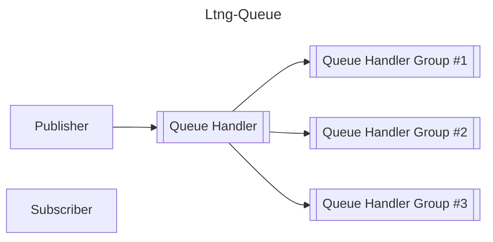

```mermaid
---
title: Ltng-Queue
---
flowchart LR
    publisher[Publisher]
    queue_handler[[Queue Handler]]
    handler_group_1[[Queue Handler Group #1]]
    handler_group_2[[Queue Handler Group #2]]
    handler_group_3[[Queue Handler Group #3]]
    subscriber[Subscriber]
    publisher --> queue_handler
    queue_handler --> handler_group_1
    queue_handler --> handler_group_2
    queue_handler --> handler_group_3
```
